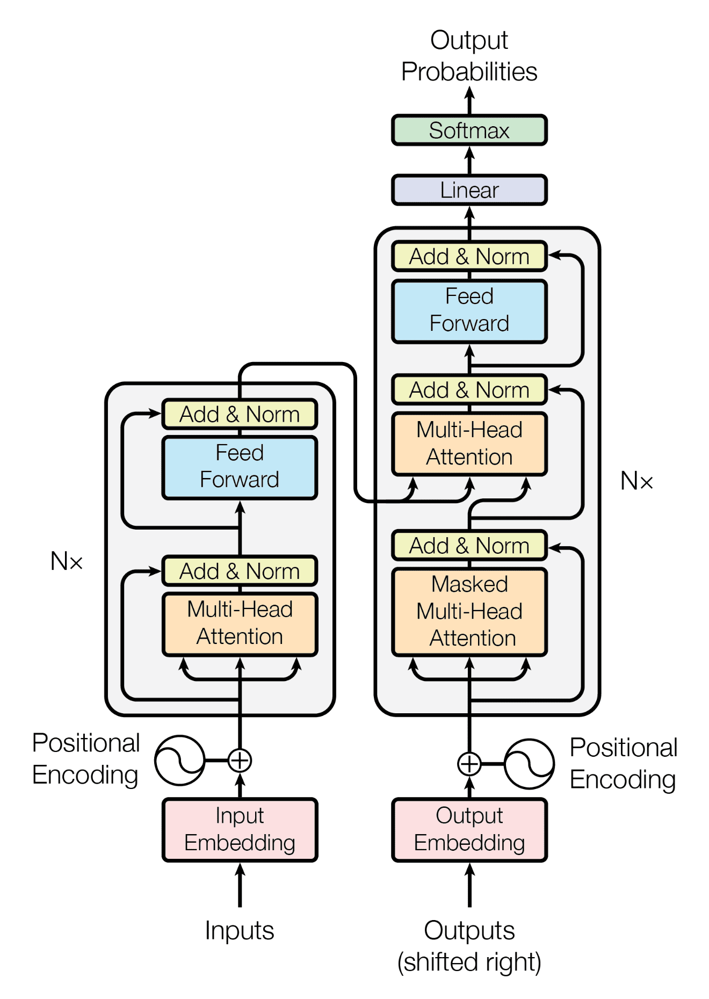

# Dịch máy Neural Anh-Việt (Transformer)

Hệ thống Dịch máy Neural (NMT) cho cặp ngôn ngữ Tiếng Anh ↔ Tiếng Việt được xây dựng dựa trên kiến trúc Transformer.
Dự án này tập trung vào việc huấn luyện, đánh giá và triển khai các mô hình dịch thuật sử dụng các kỹ thuật học sâu hiện đại.

------------------------------------------------------------------------

## Các tính năng chính

-   Kiến trúc Encoder-Decoder dựa trên Transformer
-   Cơ chế Multi-head attention (tự triển khai)
-   Hỗ trợ tập dữ liệu PhoMT & OPUS100
-   Giải mã bằng Beam search
-   Quy trình huấn luyện & đánh giá hoàn chỉnh
-   Quản lý thí nghiệm thông qua tệp cấu hình (Config-driven)

------------------------------------------------------------------------

## Cấu trúc dự án

    .
    ├── src/
    │   ├── models/        # Transformer, attention, v.v.
    │   ├── data/          # Xử lý tập dữ liệu
    │   ├── train.py       # Script huấn luyện
    │   ├── evaluate.py    # Script đánh giá
    │   └── utils/         # Các hàm bổ trợ
    ├── configs/           # Các tệp cấu hình YAML
    ├── checkpoints/       # Lưu trữ mô hình đã huấn luyện
    ├── data/              # Dữ liệu thô & đã xử lý
    ├── requirements.txt
    └── README.md

------------------------------------------------------------------------

## Cài đặt

``` bash
git clone https://github.com/your-username/envi-nmt-transformer.git
cd envi-nmt-transformer

python -m venv .venv
source .venv/bin/activate   # Linux/Mac
# .venv\Scripts\activate    # Windows

pip install -r requirements.txt
```

------------------------------------------------------------------------

## Huấn luyện

``` bash
python src/train.py --config configs/config.yaml
```

------------------------------------------------------------------------

## Đánh giá

``` bash
python src/evaluate.py --checkpoint checkpoints/best_model.pt
```

------------------------------------------------------------------------

## Mô hình



-   Kiến trúc: Transformer (Encoder-Decoder)
-   Cơ chế Attention: Multi-Head Attention
-   Hàm mất mát (Loss): Cross-Entropy
-   Tối ưu hóa (Optimization): Adam / AdamW

------------------------------------------------------------------------

## Tập dữ liệu

-   PhoMT (Tiếng Việt-Tiếng Anh)
-   OPUS100

Tiền xử lý bao gồm: - Tokenization - Làm sạch & chuẩn hóa - Padding & batching

------------------------------------------------------------------------

## Kết quả

| Mô hình           | Val BLEU ↑ | Test BLEU ↑ |
| ----------------- | :----------: | :-----------: |
| Google Translate  | 40.10      | 39.86       |
| Bing Translator   | 40.82      | 40.37       |
| Transformer-base  | 43.01      | 42.12       |
| Transformer-big   | 43.75      | 42.94       |
| mBART              | 44.32      | 43.46       |
| **Our (Nhóm tôi)**| **35.1**   | **28.62**   |

------------------------------------------------------------------------

## Định hướng phát triển

-   Tinh chỉnh các mô hình đã huấn luyện trước (PhoMT, mT5)
-   Thêm API suy luận (FastAPI)
-   Cải thiện giải mã (Top-k, nucleus sampling)
-   Huấn luyện với độ chính xác hỗn hợp (Mixed precision - FP16)


